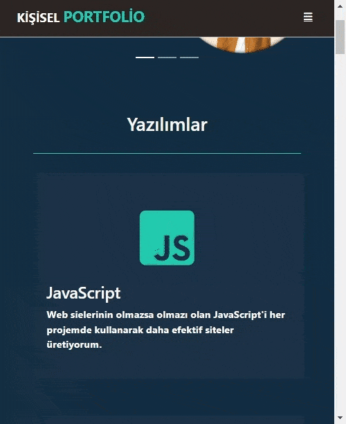

<h1>Kişisel Portfolio Web Sitesi | Personal Portfolio Website</h1>

Bir web sitesinde olması gereken temel alanlar eklenerek yapılmış bir index sayfası, ayrıca klonlamadan harici slider eklenerek farklılık yapılmıştır.

A simple personel portfolio site was created

<h3 align="left">Languages and Tools:</h3>

 

  
 
<h1>Proje Görüntüsü | Responsive Design </h1>

Responsive

